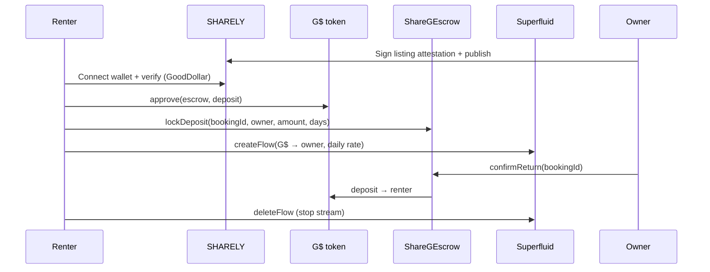

# SHARELY

**Rent neighbor gear with your daily G$ — starting in Kampala.**

SHARELY is a mobile-first web app for peer-to-peer item rentals paid with [GoodDollar](https://gooddollar.org) on [Celo](https://celo.org). Verified citizens list tools, electronics, and household items; renters pay a **daily stream** to owners and lock a **refundable deposit** in on-chain escrow.

---

## Highlights

| | |
|---|---|
| **Chain** | Celo mainnet (42220) |
| **Token** | G$ (`0x62B8B11039FcfE5aB0C56E502b1C372A3d2a9c7A`) |
| **Identity** | GoodDollar Identity + face verification |
| **Deposits** | `ShareGEscrow` — refundable on return |
| **Rental fees** | [Superfluid](https://superfluid.org) CFA Forwarder — G$/second streams |
| **Listings** | Supabase (shared across devices) + local fallback |
| **Launch city** | Kampala, Uganda — neighborhood heatmap & filters |
| **Wallets** | MetaMask, MiniPay, and other injected browser wallets |

---

## How it works



---

## Features

- Browse & filter listings by category and **Kampala neighborhood**
- **Neighborhood heatmap** on the home page
- List items with photo URL (Unsplash, Google Drive share links)
- **Sign & publish** — wallet signature proves lister ownership
- Rent flow: approve G$ → lock deposit → start Superfluid stream
- **My rentals** — confirm return, stop stream, claim deposit
- GoodDollar **face verification** and **daily G$ claim** on Profile
- Dark mode, mobile-first layout, glass bottom nav

---

## Tech stack

- **Framework:** Next.js 16 (App Router), React 19, TypeScript
- **Styling:** Tailwind CSS v4
- **Web3:** wagmi v3, viem v2
- **GoodDollar:** `@goodsdks/citizen-sdk`, `@goodsdks/react-hooks`
- **Backend:** Supabase (listings API)
- **Contracts:** Solidity 0.8.20 (`ShareGEscrow.sol`)

---

## Project structure

```
sharely/
├── contracts/ShareGEscrow.sol    # G$ deposit escrow
├── scripts/deploy-escrow.mts     # Celo mainnet deploy
├── supabase/
│   ├── schema.sql                # Listings table + RLS
│   └── SETUP.md                  # Supabase setup guide
├── src/
│   ├── app/                      # Routes + API routes
│   ├── components/               # UI, wallet, items, rentals
│   ├── config/wagmi.ts           # Celo + MetaMask connector
│   ├── hooks/                    # Identity, balance, rentals
│   └── lib/                      # Contracts, store, Kampala, images
├── public/icon.svg               # App icon
└── .env.example                  # Environment template (no secrets)
```

---

## Quick start

### Prerequisites

- Node.js 20+
- npm
- Celo wallet with **CELO** (gas) and **G$**
- Supabase project (for shared listings across testers)

### Install & run

```bash
git clone https://github.com/thestatisticia/sharely.git
cd sharely
npm install
cp .env.example .env.local
```

Edit `.env.local` with your values (see [Environment variables](#environment-variables)).

```bash
npm run dev
```

Open [http://localhost:3000](http://localhost:3000).

For production demos:

```bash
npm run build && npm start
```

---

## Supabase setup

1. Create a project at [supabase.com](https://supabase.com)
2. Run `supabase/schema.sql` in the SQL Editor
3. Copy Project URL, anon key, and service role key into `.env.local`
4. See [`supabase/SETUP.md`](supabase/SETUP.md) for full steps and Vercel deployment

**Never commit** `SUPABASE_SERVICE_ROLE_KEY` or any private keys.

---

## Deploy ShareGEscrow (Celo mainnet)

Rental deposits require a deployed escrow contract.

```bash
DEPLOYER_PRIVATE_KEY=0x... npm run deploy:escrow
```

This writes `NEXT_PUBLIC_ESCROW_ADDRESS` to `.env.local`.  
`DEPLOYER_PRIVATE_KEY` is for deployment only — never commit it.

---

## Celo mainnet addresses

| Contract | Address |
|----------|---------|
| G$ token | `0x62B8B11039FcfE5aB0C56E502b1C372A3d2a9c7A` |
| GoodDollar Identity | `0xC361A6E67822a0EDc17D899227dd9FC50BD62F42` |
| Superfluid CFA Forwarder | `0xcfA132E353cB4E398080B9700609bb008eceB125` |
| ShareGEscrow | Set via `NEXT_PUBLIC_ESCROW_ADDRESS` |

---

## Environment variables

| Variable | Required | Description |
|----------|----------|-------------|
| `NEXT_PUBLIC_SUPABASE_URL` | For shared listings | Supabase project URL |
| `NEXT_PUBLIC_SUPABASE_ANON_KEY` | For shared listings | Supabase publishable / anon key |
| `SUPABASE_SERVICE_ROLE_KEY` | Server only | Supabase secret key — **never commit** |
| `NEXT_PUBLIC_ESCROW_ADDRESS` | For rentals | Deployed `ShareGEscrow` on Celo |
| `DEPLOYER_PRIVATE_KEY` | Deploy only | Used by `npm run deploy:escrow` — **never commit** |

---

## User guide

1. **Connect** — MetaMask or MiniPay on Celo mainnet
2. **Profile** — complete GoodDollar verification, claim daily G$
3. **List** — fill details, sign in wallet, publish
4. **Browse** — rent with escrow + stream (needs G$ + CELO for gas)
5. **Rentals** — owner confirms return; renter stops stream / claims deposit

Demo seed listings use placeholder owners and cannot receive payments. List your own item to test the full payment flow.

---

## Scripts

| Command | Description |
|---------|-------------|
| `npm run dev` | Development server |
| `npm run build` | Production build |
| `npm run start` | Serve production build |
| `npm run lint` | ESLint |
| `npm run deploy:escrow` | Deploy escrow to Celo mainnet |

---

## Security

- `.env.local` and all secrets are gitignored
- Never paste service role keys or deployer private keys in chat or commits
- SHARELY does not custody funds; escrow and streams are non-custodial smart contracts
- Verify contract addresses on [Celoscan](https://celoscan.io) before mainnet use

---

## License

MIT — see `contracts/ShareGEscrow.sol` SPDX header.

---

## Links

- [GoodDollar](https://gooddollar.org)
- [GoodDollar developer docs](https://docs.gooddollar.org)
- [Celo](https://celo.org)
- [Superfluid docs](https://docs.superfluid.org)

**SHARELY** — share more, buy less, pay neighbors with G$.
